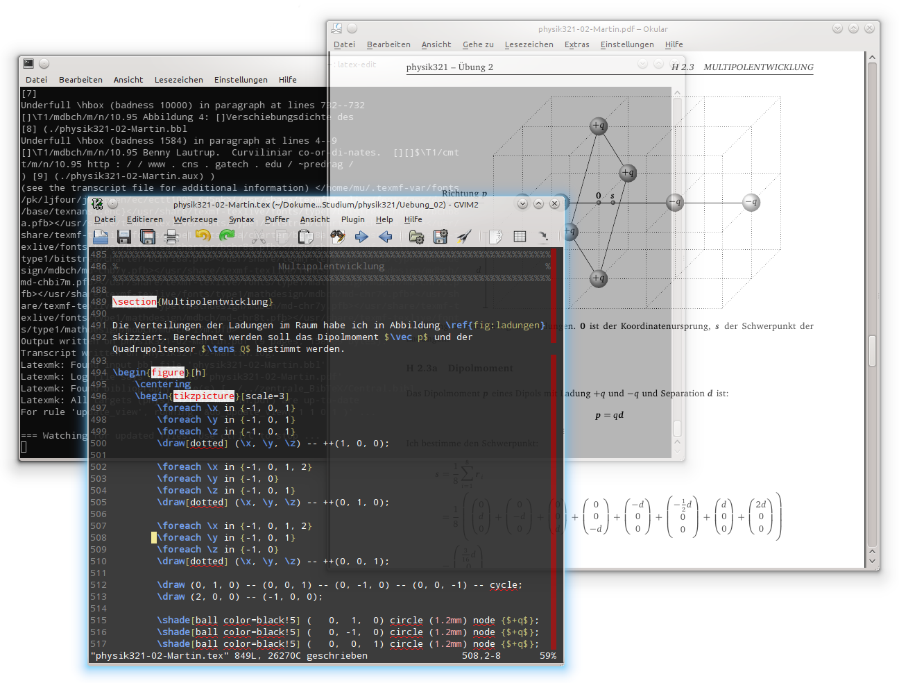

.. Copyright © 2012-2013, 2017 Martin Ueding <martin-ueding.de>

##########
latex-edit
##########

I like to use Vim for all source code, including LaTeX. For maximum comfort, I
wrote this little script that opens gVim, a terminal with ``latexmk`` and a PDF
viewer (Okular in this case) all at once.

``latexmk`` watches the ``.tex`` file and runs ``pdflatex`` every time the file
is saved in the editor. It also runs ``pdflatex`` often enough to get all the
references sorted out.

Dolphin (the KDE file manager) is set up to open any ``.tex`` with
``latex-edit`` in a terminal.

The result is this:

Installation
============

::

    make
    sudo make install

Dependencies
============

- ``latexmk``
